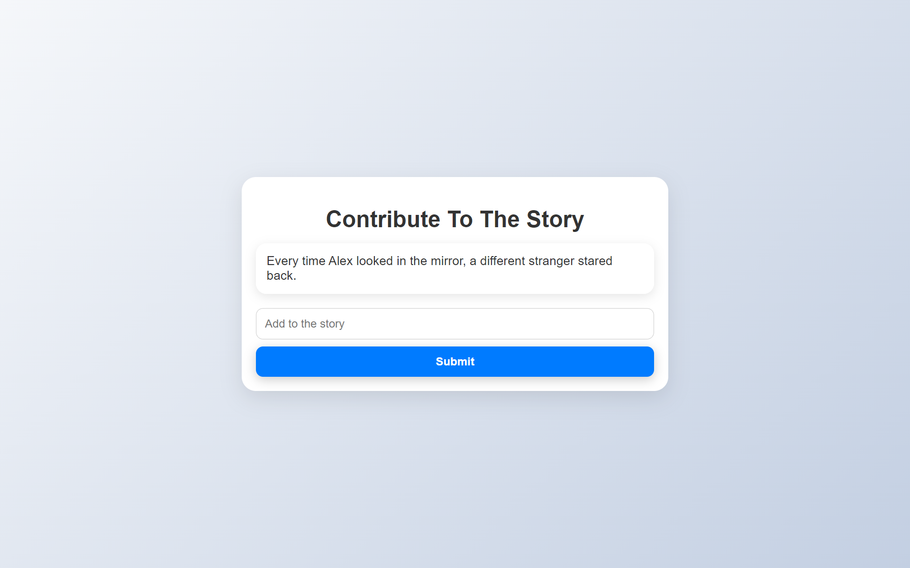
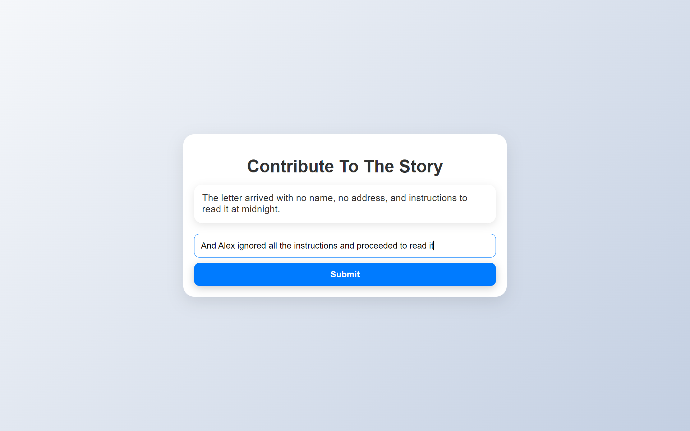
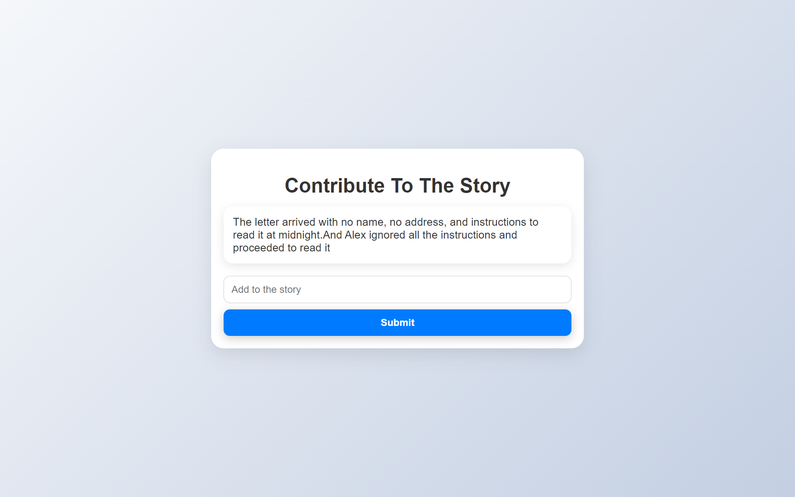

# [Project Name] 🎯

## Basic Details
### Team Name: roqcodes

### Team Members
- Team Lead: Muhammed ROnak - SOE CUSAT
- Member 2: Muhammed Danish - SOE CUSAT
- Member 3: Mohammed Ramzan- SOE CUSAT

### Project Description
A unique story telling app that offers strangers to contribute to a random inital thread and make it an entire novel which contains the creativity of large community.
one person can only add one line at a time and. and the next line can be written by anybody online at the moment.

### The Problem (that doesn't exist)
having lot of time and no other ways to waste it.

### The Solution (that nobody asked for)
same as project discription

## Technical Details
### Technologies/Components Used
For Software:
- HTML, CSS, JS
- None
- Firebase Realtime Database
- VScode, CHat GPT, Figma, and some brain

### Implementation
For Software:
# Installation
git clone https://github.com/roqcodes/roqcodes.github.io.git

# Run
-Open index.html in a browser
-go to roqcodes.github.io
### Project Documentation
For Software:

# Screenshots (Add at least 3)

the initial user interface

UI when user inputs a text.

UI when user submits. the text in textbox is updated in firebase realtime database and it is added to the story.
# Diagrams

Page Loads
-> connects to firebase db
-> fetches a random story begining from database and lets user add their story.
-> when user submits, the data is saved in database
-> shows the new story to the new users.

## Team Contributions
- Muhammed Ronak: Designed and developed the initial stages of the app.
- Muhammed Danish: Developed the final stages of the app like random story showing.
- Mohammed Ramzan: Finalized the UI design using HTMl and css
---
Made with ❤️ at TinkerHub Useless Projects 

